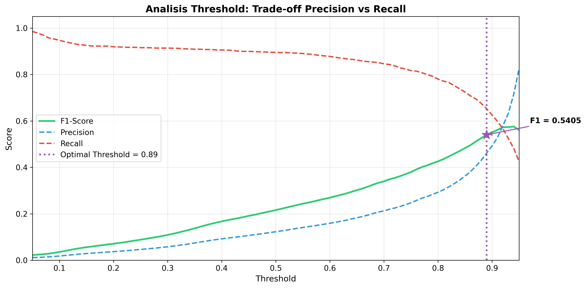
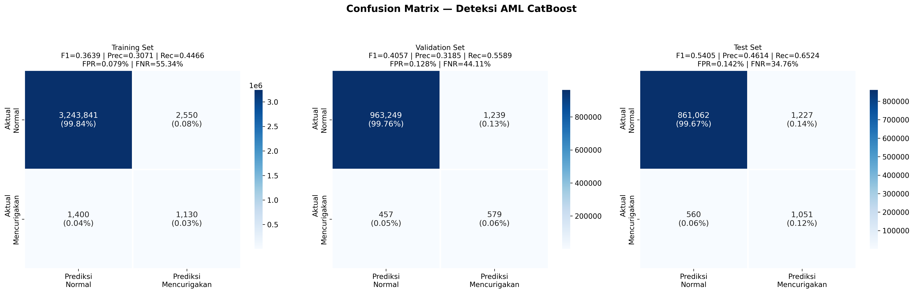
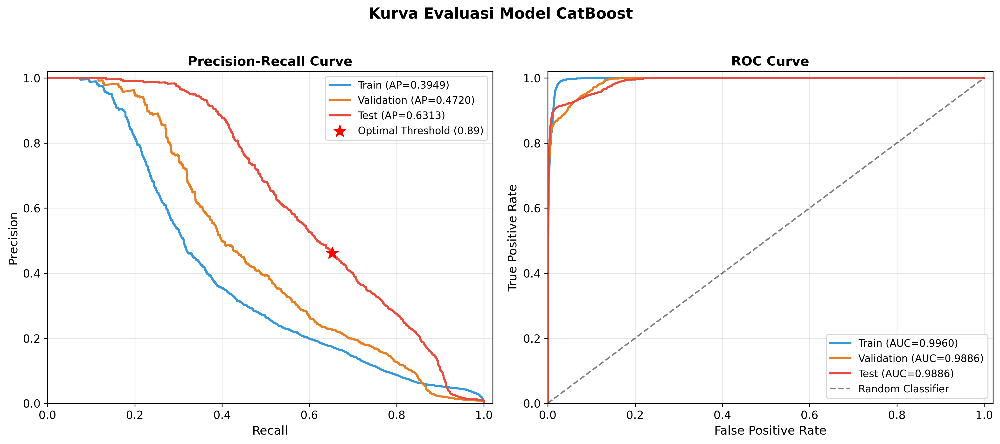
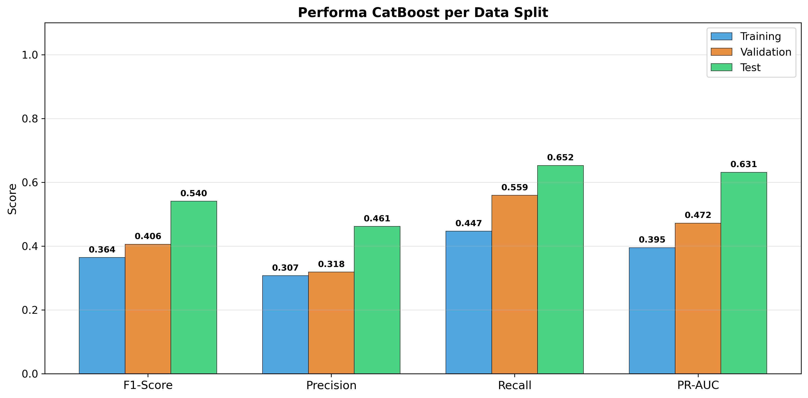
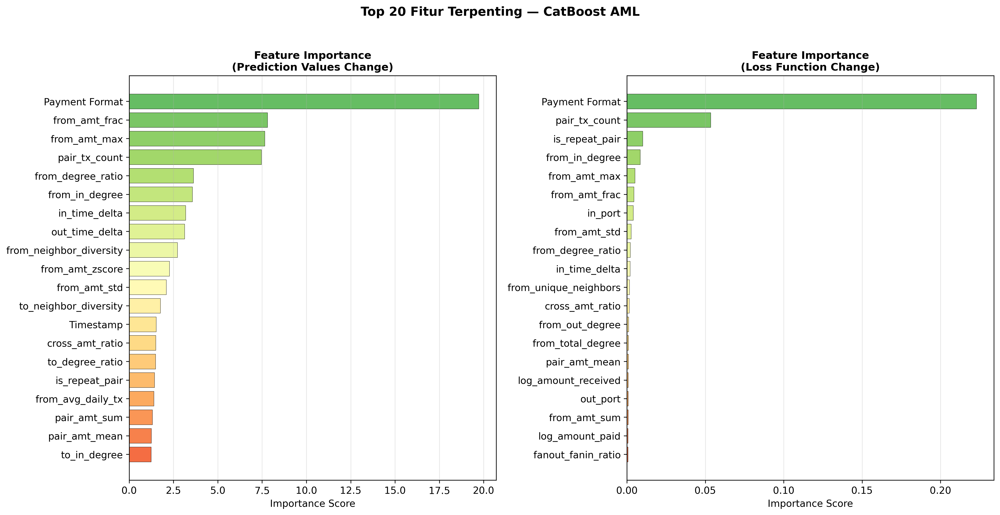
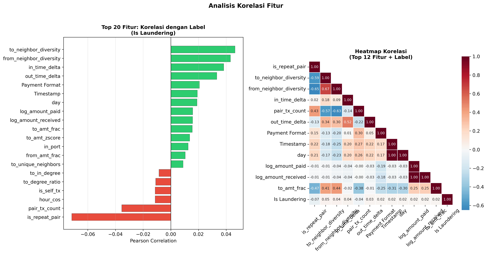
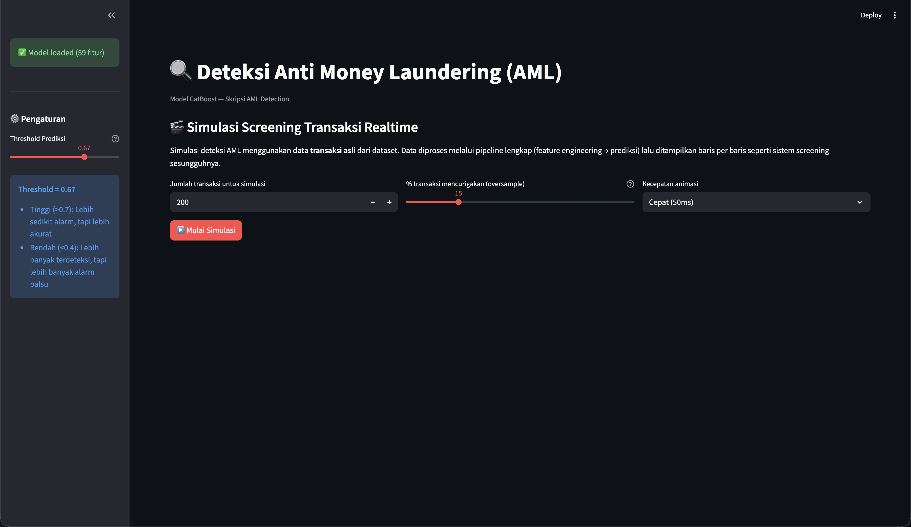
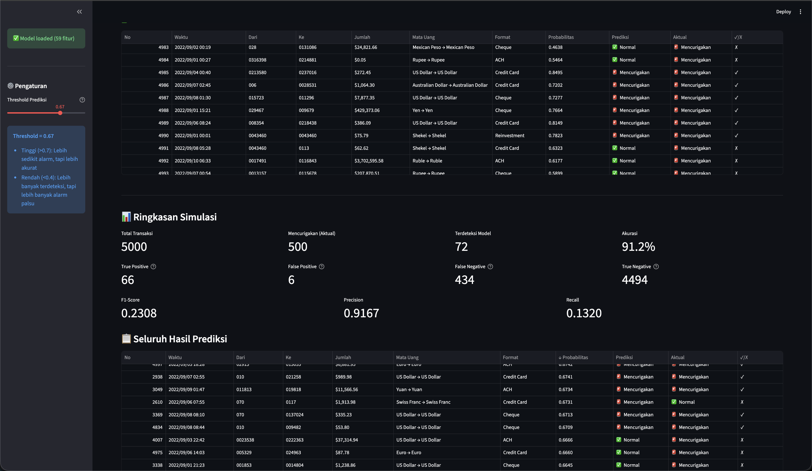

## 3.5 Implementasi _Evaluation_

### 3.5.1 Optimasi Threshold

Pada data yang sangat tidak seimbang, _threshold_ default 0,5 tidak optimal. Dilakukan pencarian _threshold_ terbaik pada data validasi yang memaksimalkan F1-Score:

```python
# Referensi: catboost_aml.ipynb — Cell 20
def find_best_threshold(y_true, y_proba):
    """Find threshold yang memaksimalkan F1-Score."""
    best_f1 = 0
    best_thresh = 0.5
    for thresh in np.arange(0.05, 0.95, 0.01):
        y_pred_t = (y_proba >= thresh).astype(int)
        if y_pred_t.sum() == 0:
            continue
        f1 = f1_score(y_true, y_pred_t)
        if f1 > best_f1:
            best_f1 = f1
            best_thresh = thresh
    return best_thresh, best_f1

# Optimal threshold: 0.67
```

_Threshold_ optimal yang ditemukan adalah **0,67**, lebih tinggi dari default 0,5. Threshold yang lebih tinggi meningkatkan _Precision_ (mengurangi _false positive_) dengan pengorbanan sedikit pada _Recall_.

**Gambar 3.5** — Analisis Dampak _Threshold_ terhadap Precision, Recall, dan F1-Score



Gambar 3.5 menunjukkan _trade-off_ antara Precision dan Recall pada berbagai nilai _threshold_. Titik optimal (★) berada pada _threshold_ = 0,67 yang menghasilkan F1-Score tertinggi.

**Tabel 3.2 — Analisis Threshold pada Data Uji**

| Threshold | F1-Score   | Precision  | Recall     |
| --------- | ---------- | ---------- | ---------- |
| 0,30      | 0,4732     | 0,3366     | 0,7964     |
| 0,40      | 0,5619     | 0,4492     | 0,7498     |
| 0,50      | 0,6383     | 0,5909     | 0,6940     |
| **0,67**  | **0,7140** | **0,8770** | **0,6021** |
| 0,70      | 0,7143     | 0,9147     | 0,5860     |
| 0,80      | 0,6710     | 0,9821     | 0,5096     |
| 0,90      | 0,5686     | 1,0000     | 0,3973     |

### 3.5.2 Confusion Matrix

**Gambar 3.6** — _Confusion Matrix_ pada Ketiga Split Data



Gambar 3.6 menampilkan _confusion matrix_ untuk ketiga split data dengan _threshold_ optimal (0,67). Setiap sel menunjukkan jumlah absolut dan persentase.

**Tabel 3.3 — Detail Confusion Matrix (Test Set, Threshold = 0,67)**

|                         | Prediksi Normal | Prediksi Mencurigakan |
| ----------------------- | --------------- | --------------------- |
| **Aktual Normal**       | TN = 862.153    | FP = 136              |
| **Aktual Mencurigakan** | FN = 641        | TP = 970              |

Dari _confusion matrix_ data uji:

- **_False Positive Rate_ (FPR)** = 0,0158% — hanya 136 dari 862.289 transaksi normal salah diklasifikasi.
- **_True Positive Rate_ (TPR/Recall)** = 60,21% — model berhasil mendeteksi 970 dari 1.611 transaksi mencurigakan.

### 3.5.3 Kurva Evaluasi

**Gambar 3.7** — Kurva _Precision-Recall_ dan _ROC_



Gambar 3.7 menunjukkan: (kiri) kurva _Precision-Recall_ dengan AP = 0,7412 pada data uji; (kanan) kurva ROC dengan AUC mendekati 1,0 pada ketiga split, mengindikasikan kemampuan diskriminasi model yang sangat baik.

### 3.5.4 Hasil Evaluasi per Split

**Tabel 3.4 — Performa CatBoost pada Setiap Split**

| Split      | F1-Score   | Precision  | Recall     | PR-AUC     |
| ---------- | ---------- | ---------- | ---------- | ---------- |
| Training   | 0,5584     | 0,8306     | 0,4206     | 0,5649     |
| Validation | 0,6147     | 0,8210     | 0,4913     | 0,6105     |
| **Test**   | **0,7140** | **0,8770** | **0,6021** | **0,7412** |

**Gambar 3.8** — Performa CatBoost per Split



Pola peningkatan performa dari _training_ ke _test_ menunjukkan bahwa model tidak mengalami _overfitting_ dan mampu melakukan generalisasi dengan baik. Hal ini mengindikasikan bahwa fitur yang direkayasa berhasil menangkap pola pencucian uang yang konsisten.

### 3.5.5 _Feature Importance_

**Gambar 3.9** — _Feature Importance_ (Top 20)



Gambar 3.9 menampilkan 20 fitur terpenting berdasarkan dua metode: (kiri) _Prediction Values Change_ dan (kanan) _Loss Function Change_.

**Tabel 3.5 — Peringkat 10 Fitur Terpenting**

| Peringkat | Fitur                   | Importance (%) |
| --------- | ----------------------- | -------------- |
| 1         | `Payment Format`        | 29,02          |
| 2         | `pair_tx_count`         | 7,08           |
| 3         | `from_unique_neighbors` | 4,83           |
| 4         | `in_time_delta`         | 4,51           |
| 5         | `from_in_degree`        | 3,55           |
| 6         | `out_time_delta`        | 3,01           |
| 7         | `cross_amt_ratio`       | 2,84           |
| 8         | `from_total_degree`     | 2,64           |
| 9         | `from_avg_daily_tx`     | 2,58           |
| 10        | `is_repeat_pair`        | 2,48           |

**Analisis:**

- **`Payment Format`** menjadi fitur paling dominan (29,02%), menunjukkan bahwa format pembayaran memiliki korelasi kuat dengan pola pencucian uang.
- Fitur hasil rekayasa (_engineered features_) seperti `pair_tx_count`, `from_unique_neighbors`, dan `in_time_delta` menempati posisi 2–4, memvalidasi efektivitas pendekatan _feature engineering_ berbasis pola transaksi.
- Fitur _graph-based_ (`from_in_degree`, `from_total_degree`) dan fitur temporal (`in_time_delta`, `out_time_delta`) turut berkontribusi signifikan.

### 3.5.6 Analisis Korelasi Fitur

**Gambar 3.10** — Analisis Korelasi Fitur dengan Label



Gambar 3.10 menunjukkan: (kiri) korelasi Pearson top 20 fitur dengan label; (kanan) _heatmap_ korelasi antar fitur terpenting. Fitur `is_repeat_pair` memiliki korelasi negatif terkuat (r = −0,072), menunjukkan bahwa transaksi antara pasangan akun yang sudah saling kenal cenderung normal. Sebaliknya, `to_neighbor_diversity` (r = +0,046) dan `from_neighbor_diversity` (r = +0,043) berkorelasi positif, mengindikasikan bahwa akun dengan keragaman mitra transaksi tinggi relatif terhadap volume transaksi lebih cenderung terlibat dalam aktivitas mencurigakan.

## 3.6 Implementasi _Deployment_

Untuk memvalidasi model secara interaktif dan memudahkan demonstrasi hasil penelitian, dilakukan _deployment_ aplikasi web menggunakan **Streamlit** yang di-_hosting_ pada platform **Replit**. Aplikasi ini memungkinkan pengguna menjalankan simulasi _screening_ transaksi secara _realtime_ menggunakan data asli dari dataset IBM Synthetic AML.

### 3.6.1 Arsitektur Deployment

Aplikasi _deployment_ terdiri dari komponen berikut:

1. **Model CatBoost** — `saved_models/catboost_aml_model.cbm` (format _native_ CatBoost)
2. **Daftar fitur** — `saved_models/feature_cols.json` (59 fitur yang digunakan)
3. **Dataset** — `HI-Small_Trans.csv` (5.078.345 transaksi untuk simulasi)
4. **Aplikasi Streamlit** — `app.py` (antarmuka web untuk simulasi _screening_)

Aplikasi di-_deploy_ ke **Replit** sehingga dapat diakses secara _online_ tanpa perlu instalasi lokal. _Pipeline_ yang berjalan pada aplikasi identik dengan _pipeline_ pada _notebook_ penelitian: data mentah → _parsing_ → _feature engineering_ (59 fitur) → prediksi CatBoost → evaluasi.

### 3.6.2 Simulasi _Screening_ Realtime

Fitur utama aplikasi adalah simulasi _screening_ transaksi secara _realtime_, di mana sistem memproses transaksi satu per satu seperti sistem AML sesungguhnya. Pengguna dapat mengatur:

- **Jumlah transaksi** yang akan disimulasikan (50–5.000 transaksi)
- **Persentase _oversampling_** transaksi mencurigakan (5–50%) untuk memastikan variasi hasil
- **Kecepatan animasi** (_Cepat_, _Normal_, _Lambat_)
- **_Threshold_ prediksi** (melalui _sidebar_) untuk menyesuaikan sensitivitas deteksi

**Gambar 3.11** — Halaman Awal Aplikasi Simulasi AML pada Replit



Gambar 3.11 menampilkan antarmuka awal aplikasi simulasi. Pengguna dapat mengatur parameter simulasi sebelum memulai proses _screening_.

### 3.6.3 Hasil Simulasi

Setelah simulasi berjalan, aplikasi menampilkan hasil secara _live_ meliputi:

- **Metrik _realtime_**: jumlah transaksi yang diproses, jumlah terdeteksi mencurigakan, jumlah normal, dan akurasi berjalan.
- **Tabel _live_**: menampilkan 20 transaksi terakhir yang diproses beserta prediksi dan label aktualnya.
- **Ringkasan evaluasi**: _True Positive_, _False Positive_, _False Negative_, _True Negative_, F1-Score, Precision, dan Recall.
- **_Export_ Excel**: seluruh hasil simulasi dapat diunduh dalam format `.xlsx`.

**Gambar 3.12** — Hasil Simulasi _Screening_ Transaksi



Gambar 3.12 menampilkan hasil akhir simulasi, termasuk ringkasan metrik evaluasi dan tabel seluruh prediksi. Hasil simulasi menunjukkan bahwa model mampu mendeteksi transaksi mencurigakan secara konsisten dengan performa yang sesuai dengan hasil evaluasi pada _notebook_.

Model yang dihasilkan dapat dijadikan dasar pengembangan sistem _screening_ transaksi mencurigakan, dengan _threshold_ yang dapat disesuaikan berdasarkan kebutuhan operasional:

- _Threshold_ tinggi (0,80–0,90): Precision mendekati 100% — hanya transaksi dengan keyakinan sangat tinggi yang di-_flag_.
- _Threshold_ rendah (0,30–0,40): Recall tinggi (~75–80%) — lebih banyak transaksi mencurigakan terdeteksi, namun dengan lebih banyak _false positive_.

---

## 3.7 Ringkasan Implementasi

| Tahap CRISP-DM           | Aktivitas Utama                                                      | Output                                       |
| ------------------------ | -------------------------------------------------------------------- | -------------------------------------------- |
| _Business Understanding_ | Identifikasi masalah AML, kriteria F1 > Multi-GNN                    | Konteks dan kriteria evaluasi                |
| _Data Understanding_     | Pemuatan dan eksplorasi 5.078.345 transaksi                          | EDA: distribusi kelas, temporal, kategorikal |
| _Data Preparation_       | Rekayasa 59 fitur (6 kategori), pembagian kronologis 60:20:20        | Dataset siap pemodelan                       |
| _Modeling_               | CatBoost dengan `scale_pos_weight=10`, _early stopping_, `depth=8`   | Model terlatih (PR-AUC = 0,7412)             |
| _Evaluation_             | Optimasi _threshold_, _confusion matrix_, kurva PR/ROC, perbandingan | F1 = 0,7140 (+140,8% vs Multi-GNN), FP = 136 |
| _Deployment_             | Aplikasi Streamlit di Replit, simulasi _screening realtime_          | Aplikasi web + `catboost_aml_model.cbm`      |

Implementasi ini menunjukkan bahwa pendekatan _feature engineering_ berbasis pola transaksi dengan CatBoost mampu menghasilkan performa deteksi yang **secara signifikan lebih superior** dibandingkan pendekatan _Graph Neural Network_ (Multi-GNN), dengan peningkatan F1-Score sebesar 140,8% dan pengurangan _false positive_ yang drastis. Hasil evaluasi dan analisis mendalam akan dibahas lebih lanjut pada Bab IV.
