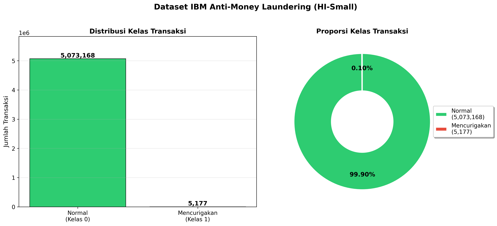
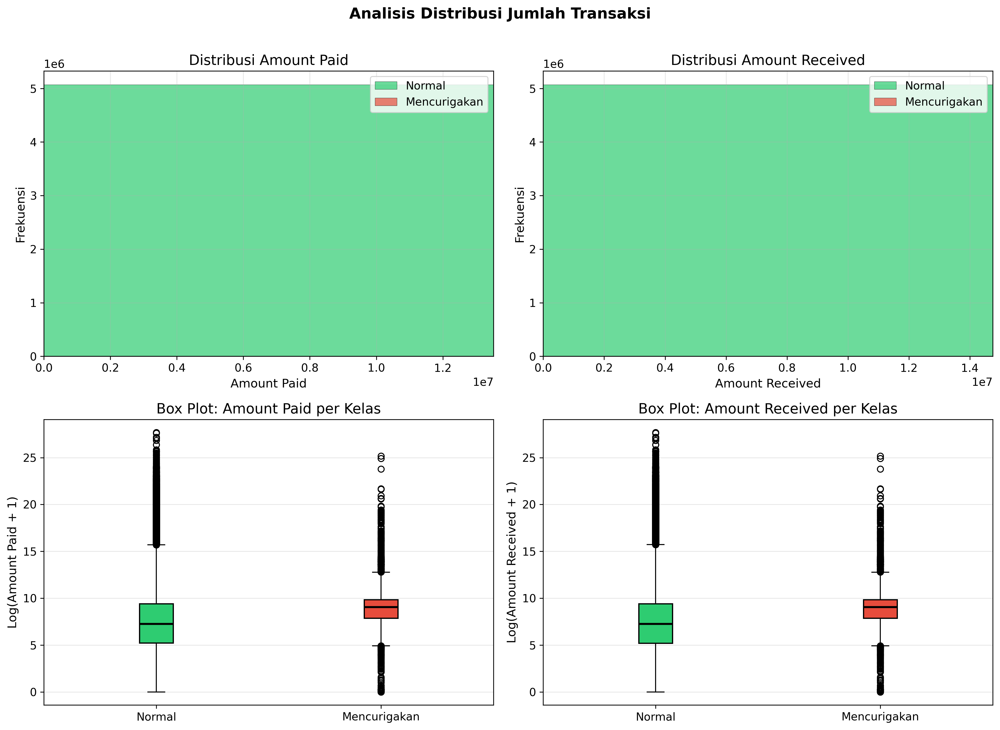
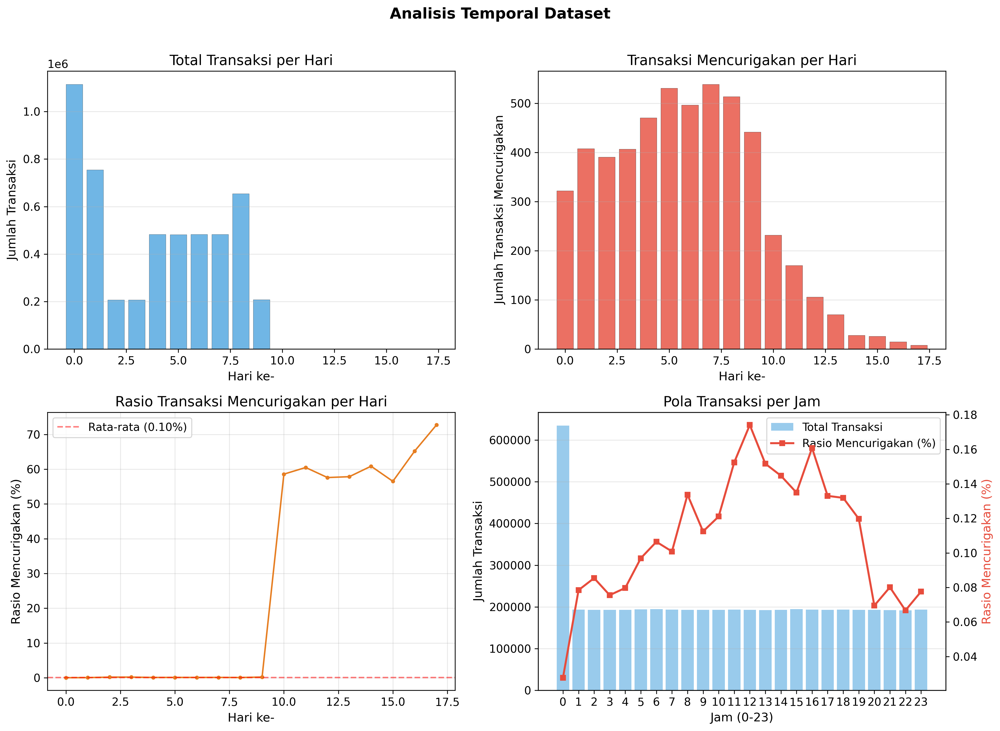
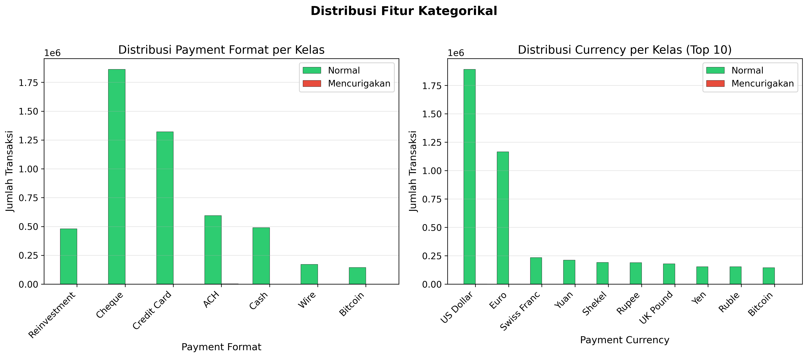

# BAB III IMPLEMENTASI METODE USULAN

## 3.1 _Business Understanding_

Masalah utama yang diangkat dalam penelitian ini adalah rendahnya kemampuan deteksi transaksi pencucian uang pada sistem keuangan. Untuk menjelaskan kenapa masalah tersebut terjadi, berikut diuraikan faktor-faktor penyebabnya:

1. **Faktor Data (_Material_)** — Volume transaksi keuangan yang sangat besar dengan rasio transaksi mencurigakan yang sangat kecil (kurang dari 0,1%) menyebabkan pola pencucian uang tenggelam di antara jutaan transaksi normal. Data yang sangat tidak seimbang ini menyulitkan proses identifikasi secara konvensional.

2. **Faktor Metode (_Method_)** — Pendekatan berbasis aturan (_rule-based_) yang umum digunakan oleh institusi keuangan cenderung kurang efektif karena aturan statis tidak mampu mengikuti pola pencucian uang yang terus berkembang dan semakin kompleks, seperti pola _fan-out_, _fan-in_, _scatter-gather_, dan _cycle_.

3. **Faktor Analisis (_Man_)** — Proses investigasi transaksi mencurigakan yang masih mengandalkan verifikasi manual membutuhkan waktu dan sumber daya yang besar, terutama ketika jumlah alarm palsu (_false positive_) sangat tinggi sehingga membebani tim kepatuhan (_compliance_).

4. **Faktor Akurasi (_Measurement_)** — Metrik evaluasi yang tidak tepat dapat memberikan gambaran performa yang menyesatkan. Pada data yang sangat tidak seimbang, akurasi keseluruhan menjadi tidak relevan karena model yang memprediksi semua transaksi sebagai normal tetap memperoleh akurasi di atas 99%.

5. **Faktor Teknologi (_Machine_)** — Kurangnya penerapan algoritma _machine learning_ modern yang mampu menangani fitur kategorikal, ketidakseimbangan kelas, dan pola temporal secara bersamaan dalam satu kerangka kerja.

Berdasarkan analisis permasalahan di atas, penelitian ini bertujuan membangun model deteksi transaksi mencurigakan menggunakan algoritma CatBoost dengan pendekatan _feature engineering_ berbasis pola transaksi. Berikut kebutuhan yang diidentifikasi pada tahap ini:

- **Tujuan bisnis**: Membantu proses _screening_ awal transaksi mencurigakan sehingga tim kepatuhan dapat memprioritaskan investigasi pada transaksi yang benar-benar berisiko tinggi.
- **Tujuan _data mining_**: Menghasilkan model klasifikasi yang mampu membedakan transaksi normal dan transaksi _laundering_ dengan F1-Score yang tinggi serta _false positive_ yang rendah.
- **Kriteria keberhasilan**: F1-Score yang lebih tinggi dari model baseline Multi-GNN (F1 = 0,2965), serta Precision yang tinggi untuk meminimalkan beban investigasi manual.
- **Data yang dibutuhkan**: Dataset transaksi keuangan berlabel yang mencakup informasi pengirim, penerima, nominal, waktu, dan format pembayaran.
- **Algoritma yang digunakan**: CatBoost, dipilih karena kemampuannya menangani fitur kategorikal dan data tidak seimbang secara langsung [13].

> **Referensi implementasi**: Seluruh kode implementasi terdapat pada notebook `CatBoost/catboost_aml.ipynb`.

---

## 3.2 Implementasi _Data Understanding_

### 3.2.1 Deskripsi Dataset

Penelitian menggunakan dataset AMLworld varian HI-Small (_High Illicit - Small_) yang dikembangkan oleh Altman et al. [12] sebagai _benchmark_ deteksi AML. Dataset transaksi (`HI-Small_Trans.csv`) memiliki atribut berikut:

| Atribut            | Tipe Data   | Deskripsi                                   |
| ------------------ | ----------- | ------------------------------------------- |
| Timestamp          | Datetime    | Waktu terjadinya transaksi                  |
| From Bank          | Kategorikal | Bank pengirim                               |
| To Bank            | Kategorikal | Bank penerima                               |
| Account            | Kategorikal | Rekening pengirim                           |
| Account.1          | Kategorikal | Rekening penerima                           |
| Amount Received    | Numerik     | Nilai transaksi diterima                    |
| Amount Paid        | Numerik     | Nilai transaksi dibayarkan                  |
| Receiving Currency | Kategorikal | Mata uang penerimaan                        |
| Payment Currency   | Kategorikal | Mata uang pembayaran                        |
| Payment Format     | Kategorikal | Format pembayaran (ACH, Wire, Cheque, dll.) |
| Is Laundering      | Binary      | Label (0: Normal, 1: Mencurigakan)          |

### 3.2.2 Pemuatan dan Pra-pemrosesan Data

Data mentah dimuat dari file CSV dan dilakukan pra-pemrosesan secara _inline_. Proses ini mencakup:

1. **_Parsing_ timestamp** — Konversi format `YYYY/MM/DD HH:MM` menjadi nilai numerik relatif (detik sejak transaksi pertama) untuk memudahkan komputasi fitur temporal.
2. **_Encoding_ akun** — Penggabungan kolom _Bank_ + _Account_ menjadi _integer ID_ unik menggunakan _dictionary mapping_. Hal ini menghasilkan identifikasi akun yang unik lintas bank.
3. **_Encoding_ kategorikal** — Mata uang (_currency_) dan format pembayaran (_payment format_) di-_encode_ menjadi _integer ID_.
4. **Pengurutan kronologis** — Data diurutkan berdasarkan _timestamp_ untuk menjaga integritas temporal.

```python
# Referensi: catboost_aml.ipynb — Cell 5 (Load Data)
from datetime import datetime

DATA_PATH = './HI-Small_Trans.csv'
raw = pd.read_csv(DATA_PATH, dtype=str)

# Encode accounts: Bank + Account → unique integer ID
from_acc_str = str(row['From Bank']) + str(row.iloc[2])
to_acc_str = str(row['To Bank']) + str(row.iloc[4])
from_id = get_dict_val(from_acc_str, account_map)
to_id = get_dict_val(to_acc_str, account_map)

# Parse timestamp to relative seconds
dt = datetime.strptime(row['Timestamp'], '%Y/%m/%d %H:%M')
ts_relative = dt.timestamp() - first_ts
```

### 3.2.3 Eksplorasi Data

Dataset memiliki **5.078.345 transaksi** dengan distribusi kelas yang sangat tidak seimbang:

| Kelas                  | Jumlah    | Proporsi  |
| ---------------------- | --------- | --------- |
| Normal (kelas 0)       | 5.073.168 | 99,90%    |
| Mencurigakan (kelas 1) | 5.177     | 0,10%     |
| **Imbalance Ratio**    |           | **1:979** |

Rasio ketidakseimbangan 1:979 menunjukkan bahwa kurang dari 1 dari setiap 1.000 transaksi merupakan transaksi mencurigakan, mencerminkan kondisi realistis dalam data AML.

**Gambar 3.1** — Distribusi Kelas Transaksi



**Gambar 3.2** — Distribusi Jumlah Transaksi (_Amount_) per Kelas



Dari Gambar 3.2 terlihat bahwa transaksi mencurigakan cenderung memiliki nilai median yang lebih tinggi (Rp 8.667) dibandingkan transaksi normal (Rp 1.411). Distribusi amount bersifat _right-skewed_ sehingga transformasi logaritmik diterapkan pada tahap _feature engineering_.

**Gambar 3.3** — Analisis Temporal Dataset



Gambar 3.3 menunjukkan pola temporal transaksi: (a) volume transaksi harian relatif stabil; (b) jumlah transaksi mencurigakan per hari; (c) rasio transaksi mencurigakan meningkat di hari-hari terakhir; (d) pola per jam menunjukkan tingkat transaksi mencurigakan yang relatif konstan sepanjang hari.

**Gambar 3.4** — Distribusi Fitur Kategorikal



Gambar 3.4 menunjukkan distribusi _Payment Format_ dan _Currency_ per kelas. Format pembayaran _Cheque_ mendominasi dataset, sementara distribusi mata uang menunjukkan USD sebagai mata uang paling umum.

**Ringkasan Dataset:**

| Metrik                   | Nilai     |
| ------------------------ | --------- |
| Total Transaksi          | 5.078.345 |
| Transaksi Normal         | 5.073.168 |
| Transaksi Mencurigakan   | 5.177     |
| Jumlah Akun Unik (Total) | 515.088   |
| Jumlah Akun Pengirim     | 496.999   |
| Jumlah Akun Penerima     | 420.640   |
| Jumlah Mata Uang         | 15        |
| Jumlah Payment Format    | 7         |
| Periode Data             | 18 hari   |

---

## 3.3 Implementasi _Data Preparation_

Tahap persiapan data dalam penelitian ini mencakup tiga aktivitas utama: normalisasi data, rekayasa fitur berbasis pola transaksi, serta pembagian data secara kronologis.

### 3.3.1 Normalisasi Timestamp

Timestamp dinormalisasi secara relatif terhadap nilai minimum sehingga dimulai dari 0, memudahkan komputasi fitur temporal:

```python
# Referensi: catboost_aml.ipynb — Cell 7
df['Timestamp'] = df['Timestamp'] - df['Timestamp'].min()
df = df.sort_values('Timestamp').reset_index(drop=True)
```

### 3.3.2 Rekayasa Fitur (_Feature Engineering_)

Fitur-fitur dirancang untuk menangkap pola-pola pencucian uang dari data tabular. Seluruh perhitungan menggunakan operasi _groupby_ yang efisien. Total **59 fitur** dihasilkan dari 6 kategori:

#### a) Fitur Berbasis Graf (_Graph-based Features_)

Fitur ini menangkap pola topologi jaringan transaksi, termasuk _degree_ (jumlah koneksi), diversitas _neighbor_, dan rasio _fan-out/fan-in_ yang mengindikasikan pola _layering_:

```python
# Referensi: catboost_aml.ipynb — Cell 8
# Degree features
out_degree = df.groupby('from_id').size().reset_index(name='from_out_degree')
in_degree = df.groupby('to_id').size().reset_index(name='to_in_degree')

# Degree ratio (asymmetry) — mendeteksi pola fan-out/fan-in
df['from_degree_ratio'] = df['from_out_degree'] / (df['from_in_degree'] + 1)

# Neighbor diversity — proporsi counterparty unik
df['from_neighbor_diversity'] = df['from_unique_neighbors'] / (df['from_out_degree'] + 1)

# Fan-out/Fan-in ratio — penting untuk deteksi layering
df['fanout_fanin_ratio'] = df['from_unique_neighbors'] / (df['to_unique_neighbors'] + 1)
```

| Fitur                                              | Deskripsi                                                |
| -------------------------------------------------- | -------------------------------------------------------- |
| `from_out_degree`, `to_in_degree`                  | Jumlah transaksi keluar/masuk per akun                   |
| `from_in_degree`, `to_out_degree`                  | _Cross-degree_ (in-degree pengirim, out-degree penerima) |
| `from_total_degree`, `to_total_degree`             | Total koneksi per akun                                   |
| `from_degree_ratio`, `to_degree_ratio`             | Rasio asimetri transaksi                                 |
| `from_unique_neighbors`, `to_unique_neighbors`     | Jumlah _counterparty_ unik                               |
| `from_neighbor_diversity`, `to_neighbor_diversity` | Proporsi _counterparty_ unik                             |
| `fanout_fanin_ratio`                               | Rasio _fan-out_ vs _fan-in_                              |

#### b) Fitur Statistik Nominal (_Amount Features_)

Fitur ini menangkap pola anomali pada nilai transaksi, termasuk _z-score_ yang mendeteksi transaksi dengan nilai menyimpang:

```python
# Referensi: catboost_aml.ipynb — Cell 9
# Statistik per akun pengirim
from_amount_stats = df.groupby('from_id')['Amount Paid'].agg(
    ['mean', 'std', 'min', 'max', 'sum', 'median']
)

# Z-score — seberapa menyimpang transaksi ini dari rata-rata akun
df['from_amt_zscore'] = (df['Amount Paid'] - df['from_amt_mean']) / (df['from_amt_std'] + 1e-8)

# Rasio amount (selisih antara yang dikirim dan diterima)
df['amount_ratio'] = df['Amount Received'] / (df['Amount Paid'] + 1e-8)

# Transformasi logaritmik untuk mengurangi skewness
df['log_amount_paid'] = np.log1p(df['Amount Paid'])
```

| Fitur                                    | Deskripsi                                 |
| ---------------------------------------- | ----------------------------------------- |
| `from_amt_mean/std/min/max/sum/median`   | Statistik nominal per akun pengirim       |
| `to_amt_mean/std/min/max/sum/median`     | Statistik nominal per akun penerima       |
| `amount_diff`, `amount_ratio`            | Selisih dan rasio nominal kirim vs terima |
| `from_amt_zscore`, `to_amt_zscore`       | _Z-score_ nominal transaksi               |
| `from_amt_frac`, `to_amt_frac`           | Fraksi nominal terhadap total volume akun |
| `log_amount_paid`, `log_amount_received` | Transformasi logaritmik nominal           |
| `cross_amt_ratio`                        | Rasio rata-rata pengirim vs penerima      |

#### c) Fitur _Port Numbering_

Terinspirasi dari pendekatan Multi-GNN [12], _port numbering_ memberikan nomor urut kepada setiap _counterparty_ unik berdasarkan waktu kemunculan pertama:

```python
# Referensi: catboost_aml.ipynb — Cell 10
def compute_ports(df):
    """Port numberings: urutan koneksi unik per node."""
    df_sorted = df.sort_values('Timestamp')
    to_port_map = {}  # to_id -> {from_id: port_number}
    for _, row in df_sorted.iterrows():
        to_node = row['to_id']
        from_node = row['from_id']
        if to_node not in to_port_map:
            to_port_map[to_node] = {}
        if from_node not in to_port_map[to_node]:
            to_port_map[to_node][from_node] = len(to_port_map[to_node])
        in_ports.append(to_port_map[to_node][from_node])
```

| Fitur      | Deskripsi                                      |
| ---------- | ---------------------------------------------- |
| `in_port`  | Urutan _counterparty_ masuk per akun penerima  |
| `out_port` | Urutan _counterparty_ keluar per akun pengirim |

#### d) Fitur _Time Delta_

Selisih waktu antar transaksi berurutan per akun, menangkap pola _burst_ transaksi:

```python
# Referensi: catboost_aml.ipynb — Cell 11
df['in_time_delta'] = df.groupby('to_id')['Timestamp'].diff().fillna(0)
df['out_time_delta'] = df.groupby('from_id')['Timestamp'].diff().fillna(0)
```

| Fitur            | Deskripsi                                             |
| ---------------- | ----------------------------------------------------- |
| `in_time_delta`  | Selisih waktu transaksi masuk berurutan per penerima  |
| `out_time_delta` | Selisih waktu transaksi keluar berurutan per pengirim |

#### e) Fitur Temporal dan _Behavioral_

Fitur ini menangkap pola perilaku transaksi, termasuk _cyclical encoding_ untuk jam, deteksi transaksi diri sendiri, dan _velocity_ transaksi harian:

```python
# Referensi: catboost_aml.ipynb — Cell 12
# Cyclical encoding untuk jam
df['hour_sin'] = np.sin(2 * np.pi * df['hour'] / 24)
df['hour_cos'] = np.cos(2 * np.pi * df['hour'] / 24)

# Self-transaction & same currency flags
df['is_self_tx'] = (df['from_id'] == df['to_id']).astype(int)
df['same_currency'] = (df['Payment Currency'] == df['Receiving Currency']).astype(int)

# Transaction velocity per hari
from_daily_avg = from_daily_count.groupby('from_id')['from_daily_tx_count'].mean()

# Pair features (frekuensi pasangan pengirim-penerima)
pair_count = df.groupby(['from_id', 'to_id']).size().reset_index(name='pair_tx_count')
df['is_repeat_pair'] = (df['pair_tx_count'] > 1).astype(int)

# Round amount flag (umum dalam laundering)
df['is_round_amount'] = ((df['Amount Paid'] % 100 == 0) |
                          (df['Amount Paid'] % 1000 == 0)).astype(int)
```

| Fitur                                  | Deskripsi                                |
| -------------------------------------- | ---------------------------------------- |
| `day`, `hour`                          | Hari dan jam transaksi                   |
| `hour_sin`, `hour_cos`                 | _Cyclical encoding_ jam (0-23 → sin/cos) |
| `is_self_tx`                           | Indikator transaksi ke diri sendiri      |
| `same_currency`                        | Indikator mata uang sama                 |
| `from_avg_daily_tx`, `to_avg_daily_tx` | Rata-rata transaksi harian per akun      |
| `pair_tx_count`                        | Frekuensi pasangan pengirim-penerima     |
| `pair_amt_mean`, `pair_amt_sum`        | Statistik nominal per pasangan           |
| `is_repeat_pair`                       | Indikator relasi berulang                |
| `is_round_amount`                      | Indikator nominal bulat                  |

#### f) Fitur Kategorikal Asli

Tiga fitur kategorikal dari dataset asli dipertahankan dan ditangani secara _native_ oleh CatBoost tanpa memerlukan _one-hot encoding_:

| Fitur                | Deskripsi            | Jumlah Kategori |
| -------------------- | -------------------- | --------------- |
| `Payment Currency`   | Mata uang pembayaran | 15              |
| `Receiving Currency` | Mata uang penerimaan | 15              |
| `Payment Format`     | Format pembayaran    | 7               |

### 3.3.3 Ringkasan Fitur

Seluruh proses _feature engineering_ menghasilkan **59 fitur** yang dikelompokkan dalam 6 kategori:

| Kategori            | Jumlah Fitur | Contoh Fitur Utama                                   |
| ------------------- | ------------ | ---------------------------------------------------- |
| Graph-based         | 13           | `from_out_degree`, `fanout_fanin_ratio`              |
| Amount Statistics   | 17           | `from_amt_zscore`, `amount_ratio`, `log_amount_paid` |
| Port Numbering      | 2            | `in_port`, `out_port`                                |
| Time Delta          | 2            | `in_time_delta`, `out_time_delta`                    |
| Temporal/Behavioral | 15           | `hour_sin`, `pair_tx_count`, `is_round_amount`       |
| Raw + Categorical   | 10           | `Amount Paid`, `Payment Format`, `Timestamp`         |
| **Total**           | **59**       |                                                      |

### 3.3.4 Pembagian Data Kronologis

Data dibagi secara kronologis berbasis hari — bukan secara acak — agar model dilatih pada transaksi masa lalu dan dievaluasi pada transaksi masa depan. Pendekatan ini sesuai dengan Altman et al. [12] dan mencegah _data leakage_ temporal.

Algoritma pembagian mencari kombinasi hari yang menghasilkan proporsi paling optimal mendekati rasio 60:20:20:

```python
# Referensi: catboost_aml.ipynb — Cell 15
split_per = [0.6, 0.2, 0.2]

# Enumerate semua kemungkinan split berdasarkan hari
for i, j in itertools.combinations(range(n_days), 2):
    split_totals = [d_ts[:i].sum(), d_ts[i:j].sum(), d_ts[j:].sum()]
    split_props = [v / sum(split_totals) for v in split_totals]
    split_error = [abs(v - t) / t for v, t in zip(split_props, split_per)]
    score = max(split_error)

# Pilih split dengan error terkecil
i, j = min(split_scores, key=split_scores.get)
```

**Hasil Pembagian Data:**

| Split      | Jumlah    | Proporsi | Mencurigakan | Rasio Mencurigakan |
| ---------- | --------- | -------- | ------------ | ------------------ |
| Training   | 3.248.921 | 64,0%    | 2.530        | 0,08%              |
| Validation | 965.524   | 19,0%    | 1.036        | 0,11%              |
| Test       | 863.900   | 17,0%    | 1.611        | 0,19%              |

Perlu dicatat bahwa rasio transaksi mencurigakan meningkat pada split di hari-hari terakhir (0,08% → 0,19%), menunjukkan distribusi yang tidak seragam dan menambah tantangan prediksi pada data uji.

---

## 3.4 Implementasi _Modeling_

### 3.4.1 Pemilihan Algoritma

Algoritma CatBoost dipilih berdasarkan beberapa pertimbangan yang relevan dengan karakteristik data AML:

1. **Penanganan fitur kategorikal _native_** — CatBoost menggunakan _target statistics_ dan _ordered boosting_ untuk memproses fitur kategorikal secara langsung tanpa _encoding_ tambahan, yang menyederhanakan alur kerja pada data transaksi.
2. **_Ordered boosting_** — Mekanisme yang menghitung statistik secara sekuensial sehingga mengurangi risiko _target leakage_, penting untuk data temporal.
3. **Regularisasi internal** — Mencegah _overfitting_ pada data dengan distribusi kelas tidak seimbang.
4. **Performa pada data _imbalanced_** — Mendukung `scale_pos_weight` yang memungkinkan kontrol bobot kelas positif secara eksplisit [13].

### 3.4.2 Penanganan Ketidakseimbangan Kelas

Dengan rasio ketidakseimbangan 1:979, pendekatan `auto_class_weights='Balanced'` terlalu agresif karena memberikan bobot ~979× pada kelas positif, menghasilkan terlalu banyak _false positive_. Sebagai gantinya, digunakan `scale_pos_weight` yang di-_cap_ pada nilai 10,0:

```python
# Referensi: catboost_aml.ipynb — Cell 18
n_pos = y_train.sum()
n_neg = len(y_train) - n_pos
imbalance_ratio = n_neg / n_pos  # ≈ 1283.8:1

# Cap weight untuk menghindari over-prediction
scale_pos = min(imbalance_ratio, 10.0)
# Hasil: scale_pos_weight = 10.0
```

Nilai 10,0 dipilih karena serupa dengan pendekatan Multi-GNN yang menggunakan `w_ce2` ≈ 6–9 untuk bobot _cross-entropy_ kelas positif.

### 3.4.3 Konfigurasi dan Pelatihan Model

```python
# Referensi: catboost_aml.ipynb — Cell 18
model = CatBoostClassifier(
    iterations=2000,
    learning_rate=0.03,
    depth=8,
    l2_leaf_reg=5,
    scale_pos_weight=10.0,
    eval_metric='F1',
    random_seed=42,
    verbose=200,
    early_stopping_rounds=100,
    task_type='CPU',
    min_data_in_leaf=50,
    random_strength=1,
    bagging_temperature=1,
)

model.fit(train_pool, eval_set=val_pool, use_best_model=True)
```

**Tabel 3.1 — Konfigurasi Hyperparameter CatBoost**

| Parameter               | Nilai | Justifikasi                                                |
| ----------------------- | ----- | ---------------------------------------------------------- |
| `iterations`            | 2.000 | Jumlah maksimum iterasi, dikontrol oleh _early stopping_   |
| `learning_rate`         | 0,03  | Nilai kecil untuk konvergensi stabil dengan banyak iterasi |
| `depth`                 | 8     | Menangkap interaksi fitur yang lebih kompleks              |
| `l2_leaf_reg`           | 5     | Regularisasi L2 untuk mencegah _overfitting_               |
| `scale_pos_weight`      | 10,0  | Bobot kelas positif (di-_cap_ dari rasio 1.283:1)          |
| `eval_metric`           | F1    | Metrik evaluasi yang relevan untuk data _imbalanced_       |
| `early_stopping_rounds` | 100   | Berhenti jika tidak ada peningkatan selama 100 iterasi     |
| `min_data_in_leaf`      | 50    | Minimum sampel per _leaf_ untuk stabilitas                 |
| `random_strength`       | 1     | Kekuatan _randomization_ pada pemilihan _split_            |
| `bagging_temperature`   | 1     | Temperatur _Bayesian bootstrap_ untuk _bagging_            |

---

## 3.5 Implementasi _Evaluation_

### 3.5.1 Optimasi Threshold

Pada data yang sangat tidak seimbang, _threshold_ default 0,5 tidak optimal. Dilakukan pencarian _threshold_ terbaik pada data validasi yang memaksimalkan F1-Score:

```python
# Referensi: catboost_aml.ipynb — Cell 20
def find_best_threshold(y_true, y_proba):
    """Find threshold yang memaksimalkan F1-Score."""
    best_f1 = 0
    best_thresh = 0.5
    for thresh in np.arange(0.05, 0.95, 0.01):
        y_pred_t = (y_proba >= thresh).astype(int)
        if y_pred_t.sum() == 0:
            continue
        f1 = f1_score(y_true, y_pred_t)
        if f1 > best_f1:
            best_f1 = f1
            best_thresh = thresh
    return best_thresh, best_f1

# Optimal threshold: 0.67
```

_Threshold_ optimal yang ditemukan adalah **0,67**, lebih tinggi dari default 0,5. Threshold yang lebih tinggi meningkatkan _Precision_ (mengurangi _false positive_) dengan pengorbanan sedikit pada _Recall_.

**Gambar 3.5** — Analisis Dampak _Threshold_ terhadap Precision, Recall, dan F1-Score


Gambar 3.5 menunjukkan _trade-off_ antara Precision dan Recall pada berbagai nilai _threshold_. Titik optimal (★) berada pada _threshold_ = 0,67 yang menghasilkan F1-Score tertinggi.

**Tabel 3.2 — Analisis Threshold pada Data Uji**

| Threshold | F1-Score   | Precision  | Recall     |
| --------- | ---------- | ---------- | ---------- |
| 0,30      | 0,4732     | 0,3366     | 0,7964     |
| 0,40      | 0,5619     | 0,4492     | 0,7498     |
| 0,50      | 0,6383     | 0,5909     | 0,6940     |
| **0,67**  | **0,7140** | **0,8770** | **0,6021** |
| 0,70      | 0,7143     | 0,9147     | 0,5860     |
| 0,80      | 0,6710     | 0,9821     | 0,5096     |
| 0,90      | 0,5686     | 1,0000     | 0,3973     |

### 3.5.2 Confusion Matrix

**Gambar 3.6** — _Confusion Matrix_ pada Ketiga Split Data


Gambar 3.6 menampilkan _confusion matrix_ untuk ketiga split data dengan _threshold_ optimal (0,67). Setiap sel menunjukkan jumlah absolut dan persentase.

**Tabel 3.3 — Detail Confusion Matrix (Test Set, Threshold = 0,67)**

|                         | Prediksi Normal | Prediksi Mencurigakan |
| ----------------------- | --------------- | --------------------- |
| **Aktual Normal**       | TN = 862.153    | FP = 136              |
| **Aktual Mencurigakan** | FN = 641        | TP = 970              |

Dari _confusion matrix_ data uji:

- **_False Positive Rate_ (FPR)** = 0,0158% — hanya 136 dari 862.289 transaksi normal salah diklasifikasi.
- **_True Positive Rate_ (TPR/Recall)** = 60,21% — model berhasil mendeteksi 970 dari 1.611 transaksi mencurigakan.

### 3.5.3 Kurva Evaluasi

**Gambar 3.7** — Kurva _Precision-Recall_ dan _ROC_


Gambar 3.7 menunjukkan: (kiri) kurva _Precision-Recall_ dengan AP = 0,7412 pada data uji; (kanan) kurva ROC dengan AUC mendekati 1,0 pada ketiga split, mengindikasikan kemampuan diskriminasi model yang sangat baik.

### 3.5.4 Hasil Evaluasi per Split

**Tabel 3.4 — Performa CatBoost pada Setiap Split**

| Split      | F1-Score   | Precision  | Recall     | PR-AUC     |
| ---------- | ---------- | ---------- | ---------- | ---------- |
| Training   | 0,5584     | 0,8306     | 0,4206     | 0,5649     |
| Validation | 0,6147     | 0,8210     | 0,4913     | 0,6105     |
| **Test**   | **0,7140** | **0,8770** | **0,6021** | **0,7412** |

**Gambar 3.8** — Performa CatBoost per Split


Pola peningkatan performa dari _training_ ke _test_ menunjukkan bahwa model tidak mengalami _overfitting_ dan mampu melakukan generalisasi dengan baik. Hal ini mengindikasikan bahwa fitur yang direkayasa berhasil menangkap pola pencucian uang yang konsisten.

### 3.5.5 _Feature Importance_

**Gambar 3.9** — _Feature Importance_ (Top 20)


Gambar 3.9 menampilkan 20 fitur terpenting berdasarkan dua metode: (kiri) _Prediction Values Change_ dan (kanan) _Loss Function Change_.

**Tabel 3.5 — Peringkat 10 Fitur Terpenting**

| Peringkat | Fitur                   | Importance (%) |
| --------- | ----------------------- | -------------- |
| 1         | `Payment Format`        | 29,02          |
| 2         | `pair_tx_count`         | 7,08           |
| 3         | `from_unique_neighbors` | 4,83           |
| 4         | `in_time_delta`         | 4,51           |
| 5         | `from_in_degree`        | 3,55           |
| 6         | `out_time_delta`        | 3,01           |
| 7         | `cross_amt_ratio`       | 2,84           |
| 8         | `from_total_degree`     | 2,64           |
| 9         | `from_avg_daily_tx`     | 2,58           |
| 10        | `is_repeat_pair`        | 2,48           |

**Analisis:**

- **`Payment Format`** menjadi fitur paling dominan (29,02%), menunjukkan bahwa format pembayaran memiliki korelasi kuat dengan pola pencucian uang.
- Fitur hasil rekayasa (_engineered features_) seperti `pair_tx_count`, `from_unique_neighbors`, dan `in_time_delta` menempati posisi 2–4, memvalidasi efektivitas pendekatan _feature engineering_ berbasis pola transaksi.
- Fitur _graph-based_ (`from_in_degree`, `from_total_degree`) dan fitur temporal (`in_time_delta`, `out_time_delta`) turut berkontribusi signifikan.

### 3.5.6 Analisis Korelasi Fitur

**Gambar 3.10** — Analisis Korelasi Fitur dengan Label


Gambar 3.10 menunjukkan: (kiri) korelasi Pearson top 20 fitur dengan label; (kanan) _heatmap_ korelasi antar fitur terpenting. Fitur `is_repeat_pair` memiliki korelasi negatif terkuat (r = −0,072), menunjukkan bahwa transaksi yang merupakan bagian dari relasi berulang cenderung normal. Sebaliknya, `to_neighbor_diversity` (r = +0,046) dan `from_neighbor_diversity` (r = +0,043) berkorelasi positif, mengindikasikan bahwa akun dengan diversitas _counterparty_ tinggi relatif terhadap volume transaksi lebih cenderung terlibat dalam aktivitas mencurigakan.

### 3.5.7 Perbandingan dengan Multi-GNN

Untuk mengevaluasi keunggulan pendekatan yang diusulkan, dilakukan perbandingan langsung dengan model Multi-GNN arsitektur GINe [12] yang menggunakan dataset dan _temporal split_ yang identik.

**Gambar 3.11** — Perbandingan CatBoost vs Multi-GNN


**Gambar 3.12** — _Radar Chart_ Perbandingan Multi-Dimensi


**Tabel 3.6 — Perbandingan Performa Model (Test Set)**

| Metrik    | Multi-GNN (GIN) | CatBoost | Δ (Selisih) | Peningkatan |
| --------- | --------------- | -------- | ----------- | ----------- |
| F1-Score  | 0,2965          | 0,7140   | +0,4175     | **+140,8%** |
| Precision | 0,2376          | 0,8770   | +0,6394     | **+269,1%** |
| Recall    | 0,3942          | 0,6021   | +0,2079     | **+52,7%**  |
| PR-AUC    | 0,2998          | 0,7412   | +0,4414     | **+147,2%** |

**Analisis Perbandingan:**

1. **F1-Score** meningkat 140,8% (0,2965 → 0,7140), menunjukkan keseimbangan Precision-Recall yang jauh lebih baik.
2. **Precision** meningkat 269,1% (0,2376 → 0,8770), yang berarti beban investigasi _false positive_ berkurang drastis — dari ribuan menjadi hanya 136 alarm palsu.
3. **Recall** meningkat 52,7% (0,3942 → 0,6021), mendeteksi lebih banyak transaksi mencurigakan.
4. **PR-AUC** meningkat 147,2% (0,2998 → 0,7412), menunjukkan kemampuan _ranking_ model yang lebih superior.

Catatan: Kedua model menggunakan _temporal split_ identik dan dataset yang sama. CatBoost menggunakan optimasi _threshold_ pada data validasi (0,67), sedangkan Multi-GNN menggunakan _threshold_ default (0,5).

---

## 3.6 Implementasi _Deployment_

Hasil penelitian ini didokumentasikan dalam Jupyter Notebook (`catboost_aml.ipynb`) yang dapat dijalankan ulang secara lengkap. Model tersimpan meliputi:

1. **Model CatBoost** — `saved_models/catboost_aml_model.cbm` (format _native_ CatBoost)
2. **Daftar fitur** — `saved_models/feature_cols.json` (59 fitur yang digunakan)
3. **Visualisasi** — 12 grafik dalam format PNG (resolusi 300 DPI) untuk dokumentasi

Model yang dihasilkan dapat dijadikan dasar pengembangan sistem _screening_ transaksi mencurigakan, dengan _threshold_ yang dapat disesuaikan berdasarkan kebutuhan operasional:

- _Threshold_ tinggi (0,80–0,90): Precision mendekati 100% — hanya transaksi dengan keyakinan sangat tinggi yang di-_flag_.
- _Threshold_ rendah (0,30–0,40): Recall tinggi (~75–80%) — lebih banyak transaksi mencurigakan terdeteksi, namun dengan lebih banyak _false positive_.

---

## 3.7 Ringkasan Implementasi

| Tahap CRISP-DM           | Aktivitas Utama                                                      | Output                                       |
| ------------------------ | -------------------------------------------------------------------- | -------------------------------------------- |
| _Business Understanding_ | Identifikasi masalah AML, kriteria F1 > Multi-GNN                    | Konteks dan kriteria evaluasi                |
| _Data Understanding_     | Pemuatan dan eksplorasi 5.078.345 transaksi                          | EDA: distribusi kelas, temporal, kategorikal |
| _Data Preparation_       | Rekayasa 59 fitur (6 kategori), pembagian kronologis 60:20:20        | Dataset siap pemodelan                       |
| _Modeling_               | CatBoost dengan `scale_pos_weight=10`, _early stopping_, `depth=8`   | Model terlatih (PR-AUC = 0,7412)             |
| _Evaluation_             | Optimasi _threshold_, _confusion matrix_, kurva PR/ROC, perbandingan | F1 = 0,7140 (+140,8% vs Multi-GNN), FP = 136 |
| _Deployment_             | Penyimpanan model dan dokumentasi _notebook_                         | `catboost_aml_model.cbm` + visualisasi       |

Implementasi ini menunjukkan bahwa pendekatan _feature engineering_ berbasis pola transaksi dengan CatBoost mampu menghasilkan performa deteksi yang **secara signifikan lebih superior** dibandingkan pendekatan _Graph Neural Network_ (Multi-GNN), dengan peningkatan F1-Score sebesar 140,8% dan pengurangan _false positive_ yang drastis. Hasil evaluasi dan analisis mendalam akan dibahas lebih lanjut pada Bab IV.
