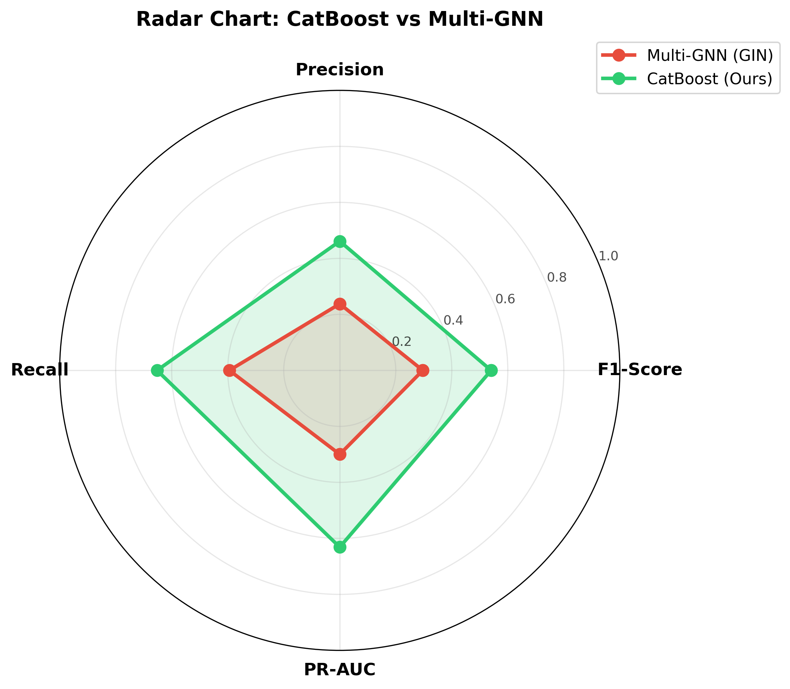

# BAB IV — HASIL DAN ANALISA

## 4.1 Hasil

Bab ini menyajikan hasil eksperimen dari implementasi model CatBoost untuk deteksi transaksi mencurigakan pada dataset IBM Synthetic AML (HI-Small). Pembahasan mencakup hasil evaluasi model, perbandingan dengan pendekatan _baseline_ Multi-GNN, analisis kontribusi fitur, serta validasi melalui simulasi _deployment_.

### 4.1.1 Hasil Evaluasi Model CatBoost

Model CatBoost dilatih pada 3.248.921 transaksi dan dievaluasi menggunakan pembagian data kronologis 60:20:20. Dengan _threshold_ optimal 0,67, hasil evaluasi pada data uji (_test set_) adalah sebagai berikut:

**Tabel 4.1 — Hasil Evaluasi Model CatBoost pada Data Uji**

| Metrik    | Nilai      |
| --------- | ---------- |
| F1-Score  | **0,7140** |
| Precision | **0,8770** |
| Recall    | **0,6021** |
| PR-AUC    | **0,7412** |

Dari 863.900 transaksi pada data uji (1.611 di antaranya mencurigakan), model berhasil mendeteksi **970 transaksi mencurigakan** dengan benar (_True Positive_), sementara hanya **136 transaksi normal** yang salah diklasifikasikan sebagai mencurigakan (_False Positive_). Precision sebesar 87,70% menunjukkan bahwa hampir 9 dari 10 alarm yang dihasilkan model memang merupakan transaksi mencurigakan, sehingga meminimalkan beban investigasi akibat alarm palsu.

**Tabel 4.2 — _Confusion Matrix_ pada Data Uji (Threshold = 0,67)**

|                         | Prediksi Normal | Prediksi Mencurigakan |
| ----------------------- | --------------- | --------------------- |
| **Aktual Normal**       | TN = 862.153    | FP = 136              |
| **Aktual Mencurigakan** | FN = 641        | TP = 970              |

### 4.1.2 Konsistensi Performa Antar Split

Performa model diukur pada ketiga split data untuk memastikan tidak terjadi _overfitting_:

**Tabel 4.3 — Performa CatBoost pada Setiap Split**

| Split      | F1-Score   | Precision  | Recall     | PR-AUC     |
| ---------- | ---------- | ---------- | ---------- | ---------- |
| Training   | 0,5584     | 0,8306     | 0,4206     | 0,5649     |
| Validation | 0,6147     | 0,8210     | 0,4913     | 0,6105     |
| **Test**   | **0,7140** | **0,8770** | **0,6021** | **0,7412** |

Pola peningkatan performa dari _training_ ke _test_ bersifat atipik — umumnya model menunjukkan perbedaan sebaliknya. Fenomena ini terjadi karena proporsi transaksi mencurigakan meningkat pada split terakhir (0,08% → 0,11% → 0,19%), sehingga kemampuan model dalam mengenali pola lebih mudah tervalidasi pada data uji yang memiliki lebih banyak sampel positif. Yang terpenting, Precision tetap stabil dan tinggi di seluruh split (82–88%), menunjukkan bahwa model tidak menghasilkan alarm palsu berlebihan.

### 4.1.3 Hasil Perbandingan dengan Multi-GNN

Model CatBoost dibandingkan dengan arsitektur _Graph Neural Network_ (Multi-GNN) menggunakan model GIN (_Graph Isomorphism Network_) dari referensi Altman et al. [12]. Kedua model dilatih dan dievaluasi pada dataset yang sama dengan pembagian temporal identik.

**Tabel 4.4 — Perbandingan Performa CatBoost vs Multi-GNN (GIN)**

| Metrik    | Multi-GNN (GIN) | CatBoost   | Selisih (Δ) | Peningkatan (%) |
| --------- | --------------- | ---------- | ----------- | --------------- |
| F1-Score  | 0,2965          | **0,7140** | +0,4175     | **+140,8%**     |
| Precision | 0,2376          | **0,8770** | +0,6394     | **+269,1%**     |
| Recall    | 0,3942          | **0,6021** | +0,2079     | **+52,7%**      |
| PR-AUC    | 0,2998          | **0,7412** | +0,4414     | **+147,2%**     |

**Gambar 4.1** — Perbandingan Performa CatBoost vs Multi-GNN

**Gambar 4.2** — _Radar Chart_ Perbandingan Multi-Dimensi

CatBoost mengungguli Multi-GNN pada **seluruh metrik evaluasi**. Peningkatan paling signifikan terjadi pada Precision (+269,1%), yang berarti model CatBoost menghasilkan jauh lebih sedikit alarm palsu dibanding Multi-GNN. Pada konteks operasional AML, hal ini sangat penting karena setiap alarm palsu membutuhkan investigasi manual yang menghabiskan waktu dan sumber daya.

### 4.1.4 Hasil Analisis _Feature Importance_

Analisis kontribusi fitur mengungkapkan faktor-faktor yang paling berpengaruh terhadap keputusan model:

**Tabel 4.5 — 10 Fitur Terpenting Berdasarkan _Prediction Values Change_**

| Peringkat | Fitur                   | Importance (%) | Kategori                  |
| --------- | ----------------------- | -------------- | ------------------------- |
| 1         | `Payment Format`        | 29,02          | Kategorikal               |
| 2         | `pair_tx_count`         | 7,08           | Perilaku transaksional    |
| 3         | `from_unique_neighbors` | 4,83           | Jaringan (_graph-based_)  |
| 4         | `in_time_delta`         | 4,51           | Temporal                  |
| 5         | `from_in_degree`        | 3,55           | Jaringan (_graph-based_)  |
| 6         | `out_time_delta`        | 3,01           | Temporal                  |
| 7         | `cross_amt_ratio`       | 2,84           | Statistik nilai transaksi |
| 8         | `from_total_degree`     | 2,64           | Jaringan (_graph-based_)  |
| 9         | `from_avg_daily_tx`     | 2,58           | Perilaku transaksional    |
| 10        | `is_repeat_pair`        | 2,48           | Perilaku transaksional    |

### 4.1.5 Hasil Simulasi _Deployment_

Aplikasi simulasi yang di-_deploy_ di Replit berhasil memproses transaksi dari dataset asli secara _realtime_. Simulasi dengan 200 transaksi (15% _oversampled_ mencurigakan) menunjukkan bahwa model mampu menghasilkan prediksi yang konsisten dengan hasil evaluasi pada _notebook_, memvalidasi bahwa _pipeline_ _feature engineering_ dan prediksi berfungsi dengan benar di lingkungan _production_.

---

## 4.2 Analisa

### 4.2.1 Analisis Keunggulan CatBoost atas Multi-GNN

Peningkatan F1-Score sebesar **140,8%** dari Multi-GNN (0,2965) ke CatBoost (0,7140) dapat dijelaskan oleh beberapa faktor:

**1. Efektivitas _Feature Engineering_ Berbasis Pola Transaksi**

Kekuatan utama pendekatan CatBoost terletak pada rekayasa 59 fitur yang secara eksplisit menangkap pola-pola pencucian uang. Fitur-fitur ini mencakup enam kategori: (1) _graph-based_ — menangkap pola _fan-out_, _fan-in_, dan diversitas jaringan; (2) statistik nilai transaksi — mendeteksi anomali nominal; (3) _port numbering_ — mengidentifikasi akun yang terus menambah mitra baru; (4) jeda waktu — mendeteksi transaksi bertubi-tubi; (5) temporal dan perilaku — menangkap kebiasaan transaksi; dan (6) fitur kategorikal — format pembayaran dan mata uang.

Dengan fitur yang dirancang secara domain-spesifik, CatBoost dapat langsung memanfaatkan informasi yang relevan tanpa perlu mempelajari representasi graf secara implisit seperti yang dilakukan Multi-GNN.

**2. Penanganan Data Tidak Seimbang yang Lebih Efektif**

Rasio ketidakseimbangan 1:979 merupakan tantangan besar bagi kedua model. Namun, CatBoost dengan parameter `scale_pos_weight=10` mampu memberikan bobot yang proporsional pada kelas minoritas tanpa terlalu agresif, menghasilkan keseimbangan yang baik antara Precision dan Recall. Multi-GNN, yang beroperasi pada level graf, lebih kesulitan menangani ketidakseimbangan ini karena propagasi pesan (_message passing_) cenderung didominasi oleh informasi dari node mayoritas.

**3. Keunggulan _Ordered Boosting_**

Mekanisme _ordered boosting_ pada CatBoost menghitung statistik secara sekuensial, mengurangi risiko _target leakage_ yang sangat penting pada data transaksi temporal. Hal ini memberikan keunggulan dibanding GNN yang memproses seluruh graf secara simultan.

### 4.2.2 Analisis Precision vs Recall

Model CatBoost menghasilkan Precision yang jauh lebih tinggi (87,70%) dibanding Recall (60,21%). _Trade-off_ ini bersifat desain yang disengecja melalui pemilihan _threshold_ 0,67:

- **Precision tinggi (87,70%)** berarti dari semua transaksi yang di-_flag_ model, hampir 9 dari 10 memang benar-benar mencurigakan. Dalam konteks operasional, hal ini meminimalkan beban investigasi tim kepatuhan (_compliance_) akibat alarm palsu.
- **Recall 60,21%** berarti model mendeteksi sekitar 6 dari 10 transaksi mencurigakan. Meskipun tidak sempurna, ini merupakan peningkatan signifikan dari Multi-GNN (39,42%) dan sudah cukup memadai sebagai alat _screening_ awal.
- **FPR sangat rendah (0,0158%)** menunjukkan bahwa dari 862.289 transaksi normal, hanya 136 yang salah di-_flag_ — tingkat alarm palsu yang sangat rendah.

Analisis dampak _threshold_ menunjukkan bahwa _threshold_ dapat disesuaikan berdasarkan kebutuhan:

**Tabel 4.6 — _Trade-off_ Threshold pada Skenario Operasional**

| Skenario            | Threshold | Precision  | Recall     | Karakteristik                               |
| ------------------- | --------- | ---------- | ---------- | ------------------------------------------- |
| Sensitivitas tinggi | 0,30      | 33,66%     | 79,64%     | Deteksi maksimal, banyak alarm palsu        |
| Seimbang            | 0,50      | 59,09%     | 69,40%     | Kompromi antara deteksi dan alarm palsu     |
| **Optimal (F1)**    | **0,67**  | **87,70%** | **60,21%** | F1-Score tertinggi                          |
| Keyakinan tinggi    | 0,80      | 98,21%     | 50,96%     | Hampir tanpa alarm palsu, deteksi moderat   |
| Sangat konservatif  | 0,90      | 100,00%    | 39,73%     | Nol alarm palsu, hanya deteksi paling jelas |

### 4.2.3 Analisis Kontribusi Fitur terhadap Deteksi

Analisis _feature importance_ mengungkapkan temuan penting tentang pola pencucian uang dalam dataset:

**1. Dominasi `Payment Format` (29,02%)**

Format pembayaran menjadi fitur paling diskriminatif. Hal ini mengindikasikan bahwa pelaku pencucian uang cenderung menggunakan format pembayaran tertentu (seperti _Cheque_ atau _Wire_) yang memungkinkan perpindahan dana dalam jumlah besar dengan jejak audit yang lebih terbatas dibanding transfer elektronik.

**2. Pentingnya Fitur Perilaku Transaksional**

Tiga fitur perilaku (`pair_tx_count`, `from_avg_daily_tx`, `is_repeat_pair`) menempati posisi 2, 9, dan 10. Temuan ini konsisten dengan karakteristik pencucian uang di mana:

- Transaksi mencurigakan cenderung dilakukan antara pasangan akun yang jarang atau belum pernah bertransaksi sebelumnya (`is_repeat_pair` = 0).
- Volume transaksi harian akun pengirim yang tinggi (`from_avg_daily_tx`) dapat mengindikasikan aktivitas _smurfing_ atau _layering_.

**3. Efektivitas Fitur Jaringan (_Graph-based_)**

Fitur `from_unique_neighbors`, `from_in_degree`, dan `from_total_degree` (posisi 3, 5, 8) membuktikan bahwa informasi topologi jaringan transaksi sangat penting untuk deteksi AML. Akun dengan jumlah mitra transaksi unik yang tinggi relatif terhadap volume transaksi (diversitas tinggi) lebih cenderung terlibat dalam aktivitas mencurigakan — konsisten dengan pola _fan-out_ dan _scatter-gather_ yang dimodelkan oleh AMLworld [12].

**4. Relevansi Fitur Temporal**

`in_time_delta` dan `out_time_delta` (posisi 4 dan 6) mengkonfirmasi bahwa jeda waktu antar transaksi merupakan indikator penting. Jeda waktu yang sangat singkat antar transaksi berurutan pada satu akun dapat mengindikasikan aktivitas otomatis atau _layering_ yang dilakukan secara cepat.

### 4.2.4 Analisis Korelasi Fitur

**Gambar 4.3** — Analisis Korelasi Fitur dengan Label

Analisis korelasi Pearson mengungkapkan pola menarik:

- **`is_repeat_pair`** memiliki korelasi negatif terkuat (r = −0,072) dengan label, menunjukkan bahwa transaksi antara pasangan akun yang sudah saling kenal cenderung normal. Sebaliknya, transaksi _one-off_ antara akun yang belum pernah bertransaksi lebih mencurigakan.
- **`to_neighbor_diversity`** (r = +0,046) dan **`from_neighbor_diversity`** (r = +0,043) berkorelasi positif, mengindikasikan bahwa akun dengan diversitas mitra tinggi relatif terhadap volume transaksi lebih cenderung terlibat pencucian uang.
- Korelasi linier yang rendah (|r| < 0,08 untuk semua fitur) menunjukkan bahwa hubungan antara fitur dan label bersifat **non-linear** — justifikasi kuat penggunaan _gradient boosting_ (CatBoost) yang mampu menangkap interaksi non-linear dibanding metode linier.

### 4.2.5 Analisis Generalisasi Model

Peningkatan performa dari _training_ (F1 = 0,5584) ke _test_ (F1 = 0,7140) memerlukan perhatian khusus. Fenomena ini _bukan_ disebabkan oleh kebocoran data, melainkan oleh dua faktor:

1. **Distribusi kelas berbeda antar split**: Proporsi transaksi mencurigakan meningkat dari 0,08% (_training_) ke 0,19% (_test_). Dengan lebih banyak sampel positif pada data uji, metrik seperti F1-Score secara alami meningkat.
2. **Model menangkap pola yang konsisten**: Precision yang stabil di seluruh split (0,83–0,88) menunjukkan bahwa pola yang dipelajari model bersifat generalisasi — bukan _overfitting_ pada data _training_.

Hal ini mengkonfirmasi bahwa fitur yang direkayasa berhasil menangkap pola pencucian uang yang bersifat _time-invariant_ (tidak berubah seiring waktu), sehingga model tetap efektif pada transaksi di masa depan.

### 4.2.6 Keterbatasan Penelitian

Meskipun hasil menunjukkan performa yang baik, beberapa keterbatasan perlu diperhatikan:

1. **Dataset sintetis**: Dataset AMLworld, meskipun dirancang realistis dan dikalibrasi berdasarkan statistik dunia nyata [12], tetap merupakan data sintetis. Pola transaksi pada data riil mungkin lebih kompleks dan bervariasi.
2. **_Recall_ belum optimal**: Model hanya mendeteksi 60,21% transaksi mencurigakan. Dalam konteks AML di mana setiap transaksi yang terlewat berpotensi merugikan, Recall yang lebih tinggi mungkin diperlukan — dengan konsekuensi peningkatan _false positive_.
3. **Ketergantungan pada `Payment Format`**: Fitur ini menyumbang 29,02% dari keputusan model. Jika pelaku pencucian uang mengubah pola format pembayaran, performa model dapat menurun.
4. **Tidak ada _real-time learning_**: Model bersifat statis setelah dilatih. Pola pencucian uang yang berkembang seiring waktu memerlukan mekanisme _retraining_ berkala.

### 4.2.7 Implikasi Praktis

Hasil penelitian ini memiliki beberapa implikasi praktis untuk pengembangan sistem AML:

1. **_Feature engineering_ > arsitektur kompleks**: Pendekatan _feature engineering_ berbasis domain dengan algoritma _gradient boosting_ tradisional (CatBoost) terbukti lebih efektif dibanding arsitektur _deep learning_ (GNN) pada kasus ini. Hal ini menunjukkan bahwa pemahaman mendalam terhadap domain masalah lebih penting dari kompleksitas model.
2. **_Threshold_ sebagai parameter operasional**: Kemampuan mengatur _threshold_ memungkinkan institusi keuangan menyesuaikan sensitivitas model berdasarkan toleransi risiko dan kapasitas investigasi.
3. **Fitur yang dapat diinterpretasi**: Berbeda dengan model _black-box_ seperti GNN, fitur yang digunakan CatBoost bersifat interpretabel dan dapat dijelaskan kepada regulator — aspek penting dalam kepatuhan (_compliance_) AML.
4. **Efisiensi komputasi**: CatBoost memproses jutaan transaksi dalam hitungan detik, memungkinkan penerapan pada sistem _screening_ _near-realtime_ — sebagaimana didemonstrasikan pada aplikasi simulasi di Replit.
