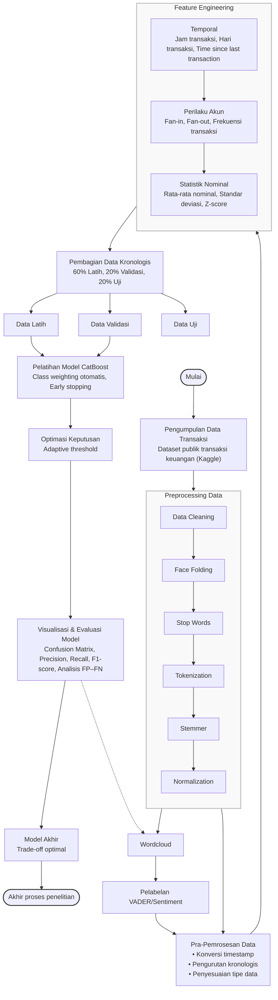

```mermaid
flowchart TD
    %% Start and End nodes
    START([Mulai])
    END([Akhir proses penelitian])

    %% Main entry
    COLLECT["Pengumpulan Data Transaksi<br/>Dataset publik transaksi keuangan (Kaggle)"]

    %% Preprocessing subgraph: vertical steps
    subgraph PREP["Preprocessing Data"]
        direction TB
        DC["Data Cleaning"]
        FF["Face Folding"]
        SW["Stop Words"]
        TOK["Tokenization"]
        STM["Stemmer"]
        NOM["Normalization"]
        DC --> FF --> SW --> TOK --> STM --> NOM
    end

    %% After preprocessing
    PRA["Pra-Pemrosesan Data<br/>• Konversi timestamp<br/>• Pengurutan kronologis<br/>• Penyesuaian tipe data"]

    %% Feature Engineering subgraph: vertical
    subgraph FE["Feature Engineering"]
        direction TB
        D1["Temporal<br/>Jam transaksi, Hari transaksi, Time since last transaction"]
        D2["Perilaku Akun<br/>Fan-in, Fan-out, Frekuensi transaksi"]
        D3["Statistik Nominal<br/>Rata-rata nominal, Standar deviasi, Z-score"]
        D1 --> D2 --> D3
    end

    %% Splitting dataset
    SPLIT["Pembagian Data Kronologis<br/>60% Latih, 20% Validasi, 20% Uji"]
    LATIH["Data Latih"]
    VALID["Data Validasi"]
    UJI["Data Uji"]

    %% Model steps
    TRAIN["Pelatihan Model CatBoost<br/>Class weighting otomatis, Early stopping"]
    OPT["Optimasi Keputusan<br/>Adaptive threshold"]
    EVAL["Visualisasi & Evaluasi Model<br/>Confusion Matrix, Precision, Recall, F1-score, Analisis FP–FN"]
    MODEL["Model Akhir<br/>Trade-off optimal"]

    %% Wordcloud and sentiment analysis branch (optional, if wanted to match your image's idea)
    WORD["Wordcloud"]
    VADER["Pelabelan VADER/Sentiment"]

    %% Main vertical flow
    START --> COLLECT
    COLLECT --> PREP
    PREP --> PRA
    PRA --> FE
    FE --> SPLIT
    SPLIT --> LATIH
    SPLIT --> VALID
    SPLIT --> UJI
    LATIH --> TRAIN
    VALID --> TRAIN
    TRAIN --> OPT
    OPT --> EVAL
    EVAL --> MODEL
    MODEL --> END

    %% Mimic horizontal/side branches for additional analysis
    PREP --> WORD
    WORD --> VADER
    VADER --> PRA

    %% Optionally: visualize output
    EVAL -.-> WORD

    %% Style for stadium start/end
    style START stroke:#333,stroke-width:2px,fill:#eef
    style END stroke:#333,stroke-width:2px,fill:#eef

    %% Style for subgraphs
    style PREP stroke:#bbb,stroke-width:2px,fill:#f9f9f9
    style FE stroke:#bbb,stroke-width:2px,fill:#f9f9f9
```
